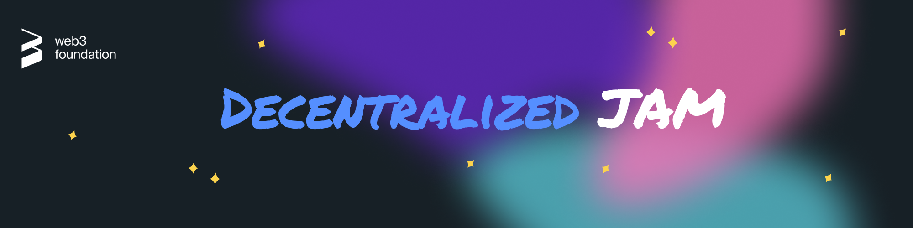

  

# JAM Prize Milestone Delivery

## Process

Prior to submitting your first milestone, please make sure that you have successfully completed a [KYB](https://in.sumsub.com/idensic/l/#/uni_LhZH9SdrmtuvGnnz) (or, if you work alone, a [KYC](https://in.sumsub.com/idensic/l/#/uni_ZUSbgdezo6hdrZVn)) check.

1. **Milestone Delivery:**
  1. Make sure that your delivery adheres to the [JAM Prize rules](https://jam.web3.foundation/rules).
  2. [Fork this repository](https://github.com/w3f/jam-milestone-delivery/fork).
  3. If this is your first milestone, create a folder for your team/project under the `deliveries` folder.
  4. Create a copy of the milestone delivery template ([`deliveries/milestone-delivery-template.md`](deliveries/milestone-delivery-template.md)) in your folder. Make sure you **do not modify the template file directly**. 
  5. Fill out the template with the details of your milestone, including all deliverables as listed in your application.
  6. Name the file `project_name-milestone_number.md`.
  7. Create a pull request and fill out the comment template.
2. **Milestone Review:**
  1. [Polkadot Fellows](https://polkadot-fellows.github.io/dashboard/) can (and usually do) issue questions, comments and may request changes on the pull request. Their feedback needs to be resolved before your milestone is accepted.
  2. An admin will merge your pull request to accept the delivery.
3. **Milestone Payment:**
  1. After the milestone is approved and the pull request merged, fill out the [invoice form](TODO).
  2. Payment is made to the Polkadot address specified in the invoice.

## Requirements

Please check the [JAM Prize website](https://jam.web3.foundation/) for participation rules. 

## Additional information

- [Graypaper](https://graypaper.com/)
- [JAM Prize Website](https://jam.web3.foundation/)
- [W3F Website](https://web3.foundation/)
- [JAM Chat](https://matrix.to/#/#jam:polkadot.io)

## License <!-- omit in toc -->

[Apache License 2.0](LICENSE) © Web3 Foundation
